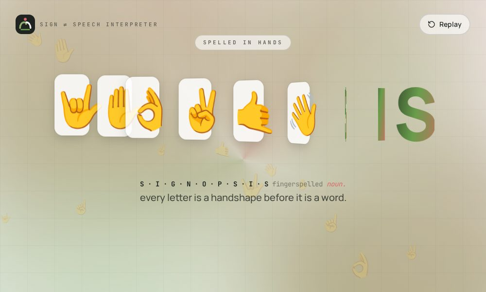
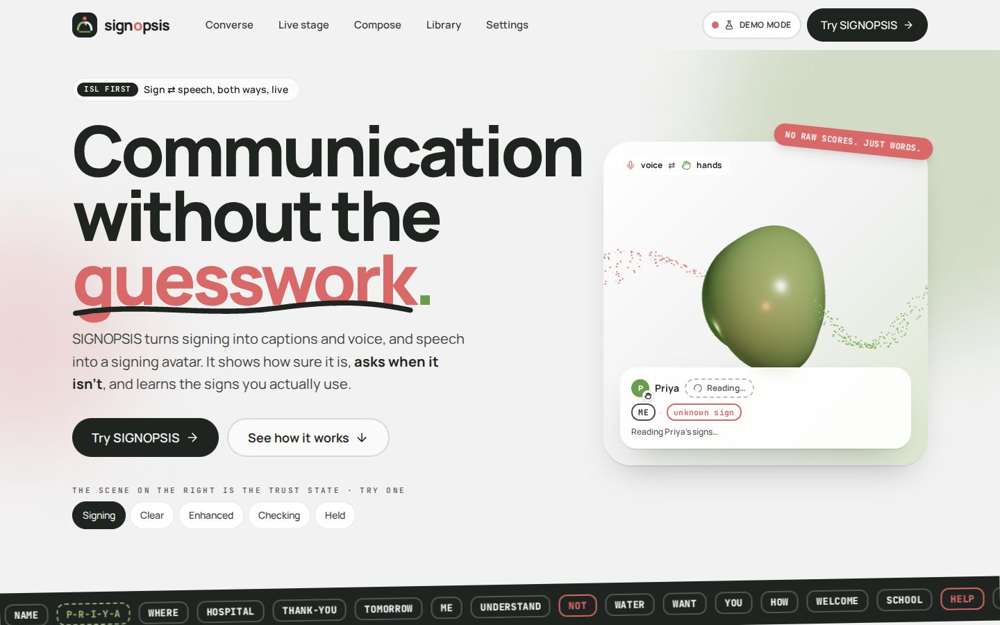
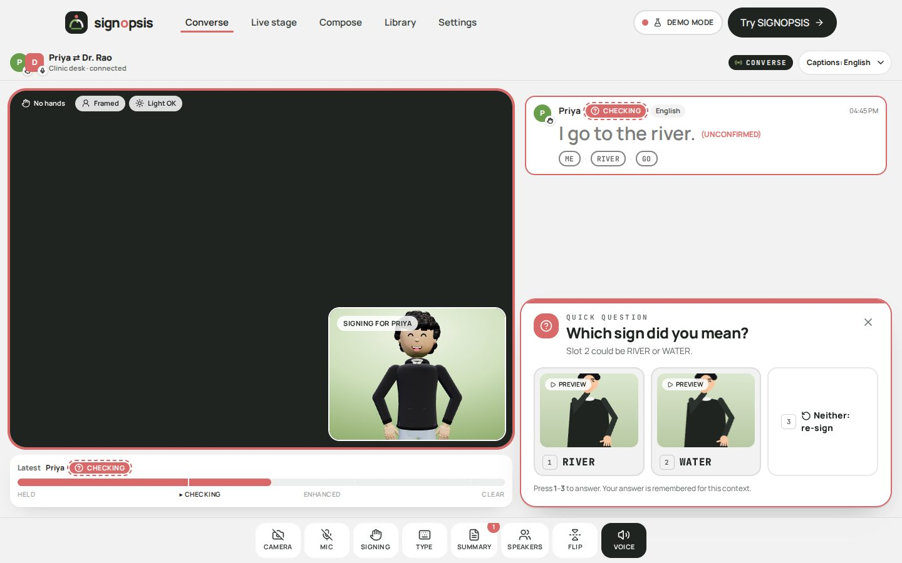
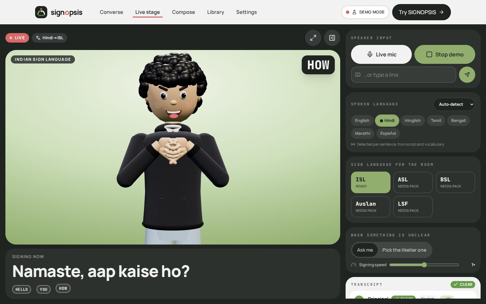

# SIGNOPSIS · web app

The frontend for **SIGNOPSIS**, a two-way sign-language interpreter. It shows how sure it is, asks when it isn't sure, and learns the signs you use.

- **React 19 + Vite 8**, **Three.js** through `@react-three/fiber` and `drei`, **Framer Motion**, **Tailwind CSS v4** and **Lucide** icons.
- **It runs with no backend.** Demo mode replays real outputs recorded from the SIGNOPSIS server.
- **Connecting the real server** takes one setting: every screen already speaks the backend's contracts.

```bash
npm install
npm run dev            # http://localhost:5173 (demo mode by default)
npm run build          # dist/: static site
npm run build:single   # dist-single/index.html: one offline file, opens from disk
npm test               # contract tests for the mock backend
```

| Intro | Landing | Converse (repair) | Live stage |
|---|---|---|---|
|  |  |  |  |

## What's inside

| Route | Screen | Backend it uses |
|---|---|---|
| `#/` | **Intro.** "synopsis" is typed, *syn* is struck and replaced by *sign*, the letters flip into hand-shape tiles, then flip back into **SIGNOPSIS**. Click anywhere (or press Enter) to go in. | none |
| `#/home` | **Landing page.** Sections: hero with a live 3D "signal field", why, six layers, live demo in a browser frame, live-stage teaser, trust states, compose, teach, glance, diagnostics, connect, CTA. | all (embedded screens) |
| `#/converse` | **S01 Converse.** Two panes (signer camera and avatar), trust bar, captions with speaker labels, repair cards, teaching offer. Dock: camera, mic, signing (simulated signer), type, summary, speakers, flip, voice. | `WS /ws/sign`, `POST /api/text-to-sign`, `GET /api/simcam`, `GET /api/sign/{g}` |
| `#/live` | **S07 Live stage.** A speaker talks and the avatar signs it for the room. The spoken language is detected automatically for each sentence. The operator chooses the output sign language (ISL, ASL, BSL, Auslan or LSF), and sets how unclear parts are handled and the signing speed. Includes presenter mode (F), hide controls (H), a demo speech and a transcript. | `POST /api/text-to-sign`, `GET /api/lexicon` |
| `#/compose` | **S03 Compose.** Text → ISL gloss → avatar preview, with round-trip read-back, repair (disambiguate / confirm), sign-language picker and dictation. | `POST /api/text-to-sign` |
| `#/enroll` | **S09 Teach a sign.** A 4-step indicator and "3 of 4 · Sign it once more, the same way." Fields: label, type (name sign / variant / work word) and scope (only me / team). Buttons: Redo last, Record, Save. | `WS /ws/sign` (`enroll_start`, `enroll_undo`, …) |
| `#/glance` | **S15 Screen Glance.** "What's happening on this page?" returns "Cart page. Three items, total ₹2,480. Checkout is a button at the bottom right." The answer is highlighted on the page, signed and spoken. | `POST /api/screen/describe` |
| `#/diagnostics` | **S18.** Charts: calibration, confidently-wrong rate by camera condition, repairs per minute, round-trip intelligibility and latency. Also the GPU mode/VRAM planner. | `GET /api/eval/report`, `GET/POST /api/mode` |
| `#/library` | **S12.** Every sign, with a 2D preview on hover and a 3D viewer on click. Also your taught signs and words that get fingerspelled. | `GET /api/lexicon`, `GET /api/sign/{g}`, `/api/users/{u}/signs` |
| `#/settings` | Backend connection (demo, auto or live; URLs; user), accessibility (motion, text size, contrast, voice), dominant hand and caption language. | `GET /healthz` |
| `#/privacy` | **S21.** What leaves the device and what never does. | none |

**The trust vocabulary.** The main UI never shows percentages. Each state is shown with colour **+** icon **+** word **+** pattern:

- **Clear:** deep green, check icon.
- **Enhanced:** sage, sparkle icon. The server emitted, but context, a personal sign or your answer helped.
- **Checking:** coral with a dashed outline and a question icon.
- **Held:** charcoal, hatched, pause icon.

## Connecting the backend

See **[docs/INTEGRATION.md](docs/INTEGRATION.md)** for the full contract map. The short version:

```bash
# terminal 1: backend repo
pip install -r requirements.txt
uvicorn signopsis.serve.main:app --port 8000

# terminal 2: this repo
echo "VITE_BACKEND_MODE=live" > .env.local
npm run dev            # Vite proxies /api, /ws, /healthz to :8000
```

**Other ways to connect:**

- **Settings page:** go to **Settings → Backend connection** and switch to *Live* or *Auto*. The choice is saved per browser.
- **URL parameters:** add `?backend=live&api=http://host:8000` to the URL.
- **Serve the app from the backend:** `npm run build && cp -r dist ../signopsis-backend/signopsis/serve/web`, then open `http://localhost:8000/app/`.

## Project layout

```
src/
  App.jsx, main.jsx          hash router, page transitions, motion prefs
  config.js                  backend mode / URLs (env → localStorage → ?query)
  contracts/contracts.d.ts   PerceptEvent, SemanticFrame, RenderPlan, WireFrame, WS messages (mirrors the Pydantic models)
  services/
    backend.js               ← the only thing screens call (live ⇄ mock switch)
    http.js, signSocket.js   REST + WebSocket clients (batching, reconnect)
    adapters.js              RenderPlan/result → UI view models, trust states
    speech.js                Web Speech in/out, spoken-language detection, sign-language list
    screen.js                DOM snapshot + local describer (Screen Glance)
    camera/mediapipeSource.js  webcam → MediaPipe → WireFrame (loaded from the backend's vendor copy or CDN)
    mock/                    mockApi, MockSignSocket, mockResolver (ISL rules), clipComposer, mockState
    metrics.js, prefs.js     session metrics, per-device preferences
  hooks/                     useSignSession, useTextToSign, useSpeechInput, useCamera, usePlayer, useBackend, …
  lib/avatar/                rig.js + avatar.js: the procedural 3D signer (shared with the backend's /avatar page)
  lib/signPlayer.js          clip playback clock (queue, seek, speed, loop)
  components/                Navbar, Hero, ThreeScene, TrustBar, TrustBadge, CaptionStack, SpeakerDot, RepairCard,
                             GlossStrip, AvatarStage, CameraStage, ShotProgress, ModeBadge, ConsentSheet,
                             ConverseScreen, ComposeScreen, EnrollmentScreen, ScreenGlance, Diagnostics, Footer, …
  pages/                     Intro, Home, ConversePage, LiveStage, ComposePage, EnrollPage, GlancePage,
                             DiagnosticsPage, Library, Settings, Privacy
  mocks/*.json               recorded backend outputs (regenerate with scripts/export_fixtures.py)
  styles/index.css           Tailwind v4 theme tokens + utilities
```

## Accessibility

- **Touch targets.** Every control is at least 48×48 px.
- **Keyboard and focus.** Visible focus rings; a skip link; `1`–`n` answers a repair card; Esc closes sheets.
- **Screen readers.**
  - ARIA roles are used throughout: `log`, `meter`, `alertdialog`, `radiogroup` and `switch`.
  - Captions sit in their own scroll area, so they never cover the stage.
  - Speakers are told apart by colour **and** shape **and** initial.
- **Motion.** The app follows `prefers-reduced-motion`, and you can override it in Settings. The 3D scenes calm down and the intro shows its final frame.
- **Text size.** Can be increased in Settings (Aa, Aa+, Aa++).
- **Contrast.** There is a stronger-contrast option in Settings.

## Honest limits

- **Placeholder signs.** Sign motions are placeholders from the prototype lexicon.
- **ISL only.** The server signs ISL. For any other sign language, the request carries `sign_lang` and the UI says a lexicon pack is missing.
- **Demo mode doesn't recognise signing.** Phrase boundaries come from real hand presence. The phrase content comes from recorded server transcripts.
- **Speech recognition depends on the browser.** It uses the Web Speech API, which works in Chrome and Edge. Where it isn't available, Live stage offers a scripted demo speech and a type-a-line box.
